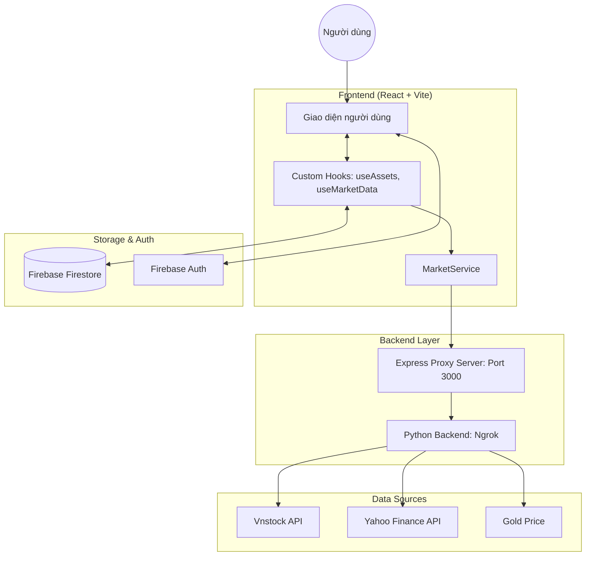
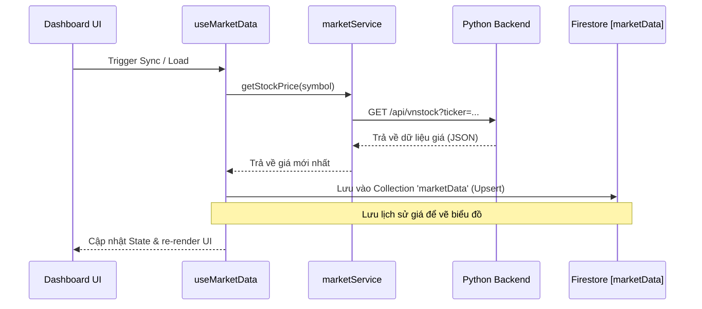
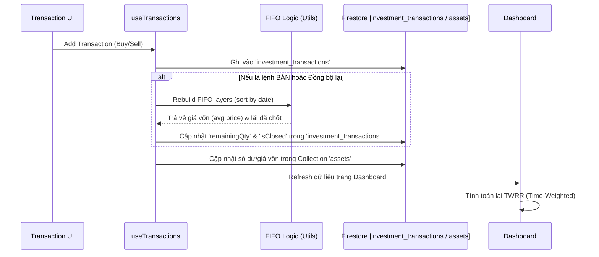
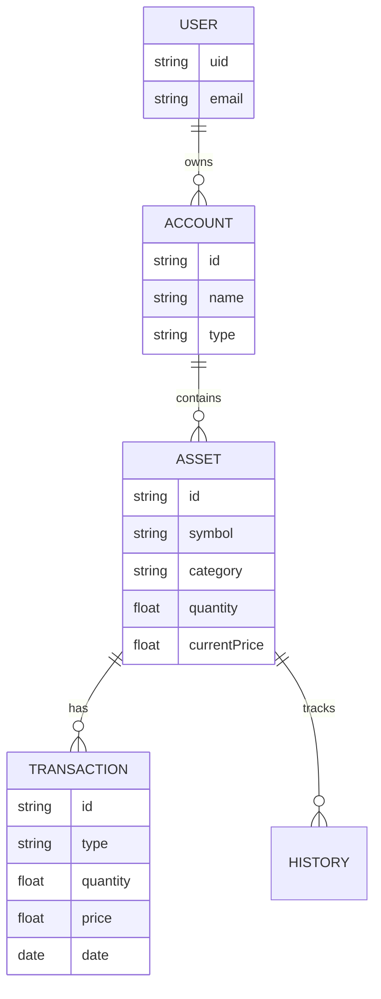

# System Diagrams

Tài liệu này chứa các sơ đồ luồng dữ liệu và tương tác giữa các thành phần trong hệ thống Wealth Tracker.

## 1. Sơ đồ kiến trúc tổng quát (System Flowchart)

Sơ đồ này mô tả cách các thành phần giao tiếp với nhau để lấy dữ liệu thị trường và lưu trữ dữ liệu người dùng.

## 2. Luồng đồng bộ giá thị trường (Sequence Diagram)

Sơ đồ này mô tả quy trình cập nhật giá hiện tại cho các tài sản.

**Kích hoạt khi:** 
1. Người dùng nhấn nút **"Lưu giá thị trường vào DB"** trong Cài đặt.
2. Hoặc sau khi thực hiện **"Bulk Import"** thành công.

## 3. Luồng xử lý giao dịch & FIFO (Sequence Diagram)

Mô tả cách hệ thống xử lý dữ liệu tài chính khi có biến động về giao dịch.

**Kích hoạt khi:**
1. Người dùng nhập lệnh **Mua/Bán lẻ** trong Modal giao dịch.
2. Người dùng thực hiện **Bulk Import JSON** (Hệ thống tự động kích hoạt sau khi hoàn tất).
3. Người dùng nhấn **"Đồng bộ lịch sử"** trên trang Tổng quan để tính toán lại toàn bộ.

## 4. Phân cấp dữ liệu (Data Hierarchy)

